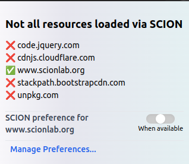
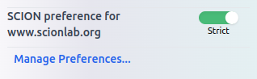
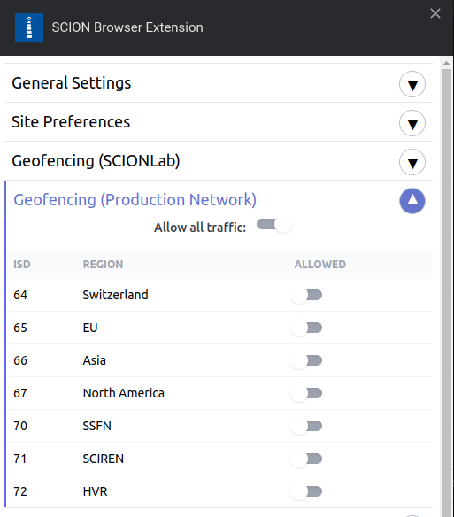
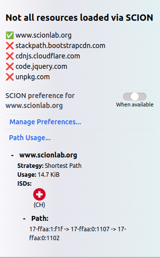

SCION Browser Extension
=======================

The SCION browser extension is a tool that provides access to HTTP(S) resources via SCION for chromium-based browsers.
You can find the source code on https://github.com/scionproto-contrib/browser-extension.

The SCION browser extension is part of a broader group of `SCION Applications <https://docs.scion.org/projects/scion-applications/en/latest>`_ .

.. note::
    The `latest version <https://github.com/scionproto-contrib/browser-extension/releases/tag/v0.3.0-beta>`_ of the extension  
    contains a known limitation of 30000 DNR rules (equivalent at resolved hostnames under ``strict-mode``). 
    Therefore, in case that limit is exceeded, ``strict-mode`` may no longer behave as intended. 
    In this case, it is advised to reinstall the extension.
    A future release will address this issue.

Requirements
------------

The extension interacts with the `SCION HTTP Forward Proxy <https://scion-http-proxy.readthedocs.io/en/latest/forward-proxy.html>`_ to fetch resources via SCION.
As stated in the documentatin, the SCION HTTP Forward Proxy can be connected to either the SCION production network, e.g., being part of the `SCIERA ISD <https://sciera.readthedocs.io/en/latest/>`_ or
it can be part of the `SCIONLab network <https://www.scionlab.org/>`_, e.g., you are running your own SCIONLab AS and have already set uo the `SCION HTTP Forward Proxy <https://scion-http-proxy.readthedocs.io/en/latest/forward-proxy.html>`_ .

More information on the different SCION networks and how to access them can be found at https://docs.scion.org/projects/scion-applications/en/latest/applications/access.html 

In-network Proxy mode
~~~~~~~~~~~~~~~~~~~~~

If your network domain offers an in-network proxy, double check with your network administrator to connect to it.
More details can be found in the `Proxy configuration`_ section.

.. note::
    If your network is part of the `SCIERA ISD <https://sciera.readthedocs.io/en/latest/>`_, you can also try to `contact us <https://docs.scion.org/projects/scion-applications/en/latest/#contact-us>`_.
    Please specify ``HTTP-Proxy`` as the subject of the email.

Self-hosted Proxy option
~~~~~~~~~~~~~~~~~~~~~~~~

If you rather prefer to run your own proxy, you can follow the instructions in the `documentation <https://scion-http-proxy.readthedocs.io/en/latest/forward-proxy.html#running-the-scion-http-forward-proxy-locally>`__.
Please note that for this configuration, you will need to follow the instructions to enable a SCION endhost stack on your machine. 
The `prerequisites section <https://scion-http-proxy.readthedocs.io/en/latest/forward-proxy.html#prerequisites>`__ provides a detailed guide on how to set it up.

Installation
------------

At the moment, we support only chromium based browsers (e.g. Chrome, Brave), other browsers will follow. 
To install the browser extension, download and unzip the `latest release <https://github.com/scionproto-contrib/browser-extension/releases/tag/v0.3.0-beta>`_.

Then navigate to `Extensions->Manage Extensions`. 
On the upper right corner, enable `Developer Mode`. Then click the `Load unpacked` button and select the ``/chrome`` folder in the unzipped folder.

Proxy configuration
-------------------

The browser extension will automatically configure the proxy settings for you, using WPAD (Web Proxy Auto-Discovery Protocol). 
This mechanism is used to automatically detect the proxy settings in your network. The browser use the generic WPAD URL ``http://wpad/wpad_scion.dat`` to find the proxy configuration file.
Subsequently, it will validate the SCION proxy configuration file and set the proxy settings accordingly.

If the WPAD mechanism is not available in your network, the browser extension will fallback to the defaults settings, i.e., using a generic hostname for the SCION HTTP Forward Proxy.
If within a search domain, the browser resolves the generic hostname accordingly.
Firstly, the extension will try to connect using HTTPS, if this fails, it will try to connect using HTTP. 
For more information regarding the needed configuration, for instance, certificate import, please check the `SCION HTTP Forward Proxy configuration <https://scion-http-proxy.readthedocs.io/en/latest/forward-proxy.html#configuration>`_ documentation.

Finally, if none of this works, the user may manually configure the proxy settings in the browser, by navigating to `Extensions->Manage Extensions->Proxy settings`.

Usage
-----

The SCION Browser Extension can work in two modes: In the default mode, the extension loads resources via SCION for SCION-enabled domains and for the rest, it loads them via BGP/IP.

In the strict mode, only resources from SCION-enabled domains are loaded.

Geofencing (Whitelisting)
-------------------------

To configure the ISD whitelist, press the `Options` button. SCION traffic will traverse only those ASes that have been enabled using the toggle button.

Path usage information
-----------------------

The extension provides path information to the user about the path used during the connection.
It provides visual information about the ISD traversed, the exchanged data amount and detailed information about the traversed ASes.

.. note::
    At the moment, path information is only available if you have previously configured geofencing policies for the extension.
    One can configure the "Allow all traffic" option to see the path information, while allowing traffic to any ISD.
    This is due to security concerns, although it is not a future compromise.

SCION enabled domains
--------------------------

Please check the `SCION enabled domains <https://scion-http-proxy.readthedocs.io/en/latest/forward-proxy.html#scion-enabled-domains>`_ for a list of domains that are SCION-enabled.